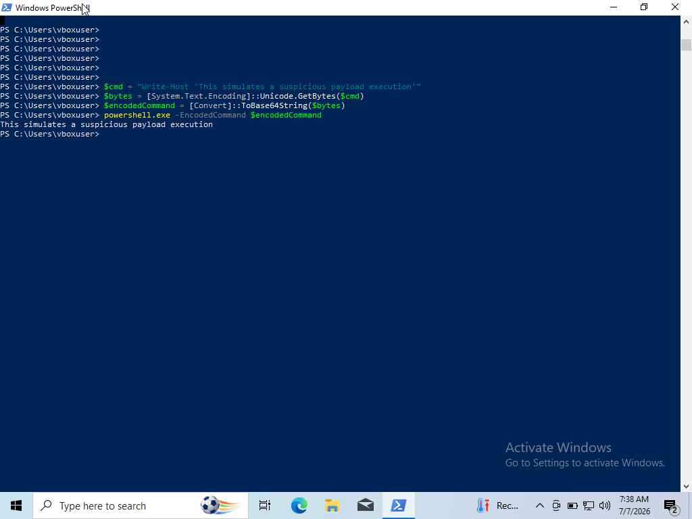
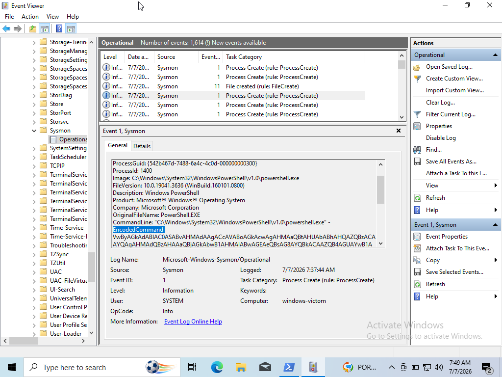
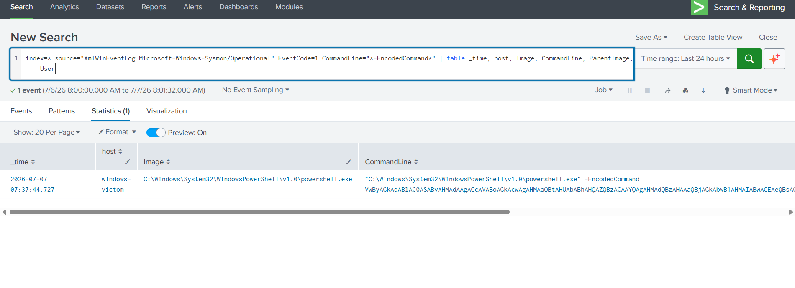

# Attack 1: PowerShell Encoded Command Execution

**MITRE ATT&CK:** [T1059.001 — Command and Scripting Interpreter: PowerShell](https://attack.mitre.org/techniques/T1059/001/)

## Objective

Simulate an attacker executing a base64-encoded PowerShell command — a common obfuscation technique used to slip past simple keyword/string-based defenses — and verify Sysmon + Splunk detect it via full command-line visibility.

## Environment

- **Executed on:** Windows victim VM
- **Detection source:** Sysmon (Event ID 1 — Process Create) → Splunk

## Attack Steps

Run in PowerShell on the victim:

```powershell
$cmd = "Write-Host 'This simulates a suspicious payload execution'"
$bytes = [System.Text.Encoding]::Unicode.GetBytes($cmd)
$encodedCommand = [Convert]::ToBase64String($bytes)
powershell.exe -EncodedCommand $encodedCommand
```



## Detection

### Raw Sysmon Event (Event ID 1 — Process Create)

Key fields:
- `Image`: `C:\Windows\System32\WindowsPowerShell\v1.0\powershell.exe`
- `CommandLine`: contains `-EncodedCommand` + base64 payload
- `ParentImage`: parent PowerShell process



### Splunk Detection Query

```spl
index=main sourcetype="XmlWinEventLog:Microsoft-Windows-Sysmon/Operational" EventCode=1 CommandLine="*-EncodedCommand*"
| table _time, host, Image, CommandLine, ParentImage, User
```



## Analysis

**What worked:** Sysmon's full command-line logging is the key defensive value here — many basic Windows logging setups only record that `powershell.exe` ran, not what argument it was given. Full command-line visibility is what makes this technique detectable at all.

**Limitation:** This query only catches the literal string `-EncodedCommand`. A real attacker could use PowerShell's abbreviated flag forms (`-e`, `-enc`) to dodge a naive string match.

**Improved query** to also catch abbreviated flags:

```spl
index=main sourcetype="XmlWinEventLog:Microsoft-Windows-Sysmon/Operational" EventCode=1 Image="*powershell.exe"
| regex CommandLine="(?i)-e(nc|ncodedcommand)?\s"
```

**Real-world relevance:** Base64-encoded PowerShell is one of the most common techniques seen in real intrusions and commodity malware, precisely because it defeats simple substring-based alerting while still being fully visible to process-level logging like Sysmon.
