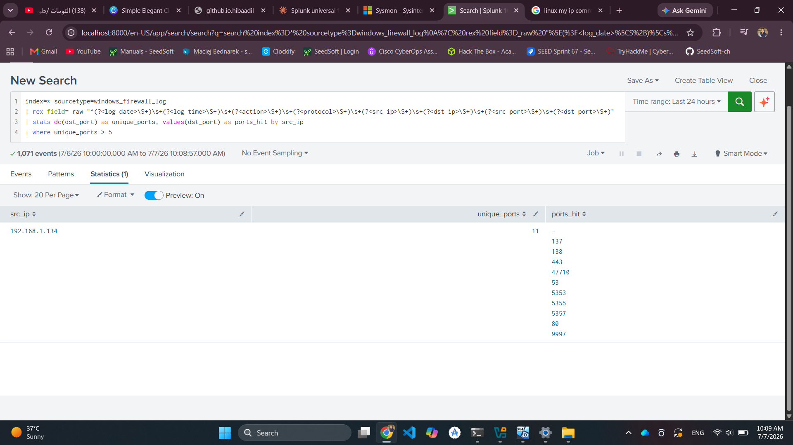

# Attack 2: Network Port Scan (Reconnaissance)

**MITRE ATT&CK:** [T1046 — Network Service Discovery](https://attack.mitre.org/techniques/T1046/)

## Objective

Simulate an attacker scanning the victim for open ports/services, and detect the scan pattern via network-level logging.

## Environment

- **Executed from:** Kali Linux attacker
- **Detection source:** Windows Firewall log (`pfirewall.log`) → Splunk

> **Note:** Sysmon's default (SwiftOnSecurity) config is tuned to catch *outbound* connections initiated by suspicious processes, not inbound scan traffic hitting the host from outside. Sysmon Event ID 3 (Network Connection) did **not** capture this scan — Windows Firewall logging was used instead as the correct data source for this technique. This mismatch is itself a useful finding (see Analysis).

## Attack Steps

From the Kali attacker:

```bash
nmap -sT -sV 192.168.1.134
```


## Detection

### Enabling Windows Firewall Logging (victim)

1. Windows Defender Firewall with Advanced Security → Properties → (active profile tab) → Logging → Customize
2. Set **Log dropped packets** = Yes, **Log successful connections** = Yes
3. Log file: `C:\Windows\System32\LogFiles\Firewall\pfirewall.log`

### Raw Firewall Log Entry

```
2026-07-07 09:55:36 DROP TCP 192.168.1.120 192.168.1.134 39700 139 60 S 2994315390 0 64240 - - - RECEIVE
```

This is a classic SYN-scan signature: a DROP action on an unsolicited inbound SYN packet to port 139 (NetBIOS).


### Forwarding to Splunk

`inputs.conf` on the Universal Forwarder:

```ini
[monitor://C:\Windows\System32\LogFiles\Firewall\pfirewall.log]
disabled = 0
sourcetype = windows_firewall_log
```

### Splunk Detection Query

```spl
index=* sourcetype=windows_firewall_log action=DROP
| rex field=_raw "^(?<log_date>\S+)\s+(?<log_time>\S+)\s+(?<action>\S+)\s+(?<protocol>\S+)\s+(?<src_ip>\S+)\s+(?<dst_ip>\S+)\s+(?<src_port>\S+)\s+(?<dst_port>\S+)"
| stats dc(dst_port) as unique_ports, values(dst_port) as ports_hit by src_ip
| where unique_ports > 5
```



## Analysis

**What worked:** Windows Firewall logging captured every individual connection attempt with full source/destination/port detail — enough to reconstruct the scan pattern.

**Detection logic:** A single connection means nothing on its own. The signal is the *pattern*: one source IP touching many distinct destination ports in a short time window. This `dc(dst_port) > N` approach mirrors real SOC port-scan correlation rules.

**Why not Sysmon:** This is the most important lesson from this attack — Sysmon's NetworkConnect rule (as configured via SwiftOnSecurity) is scoped to outbound connections from a defined set of processes, not general inbound traffic. Choosing the right log source for a technique is as important as writing the detection query itself.

**Limitation:** A slow/stealthy scan (e.g., `nmap -T1`, spread over hours) would evade a detection window that only buckets by a single search run. A production version of this search would need scheduled, sliding time-window logic.
