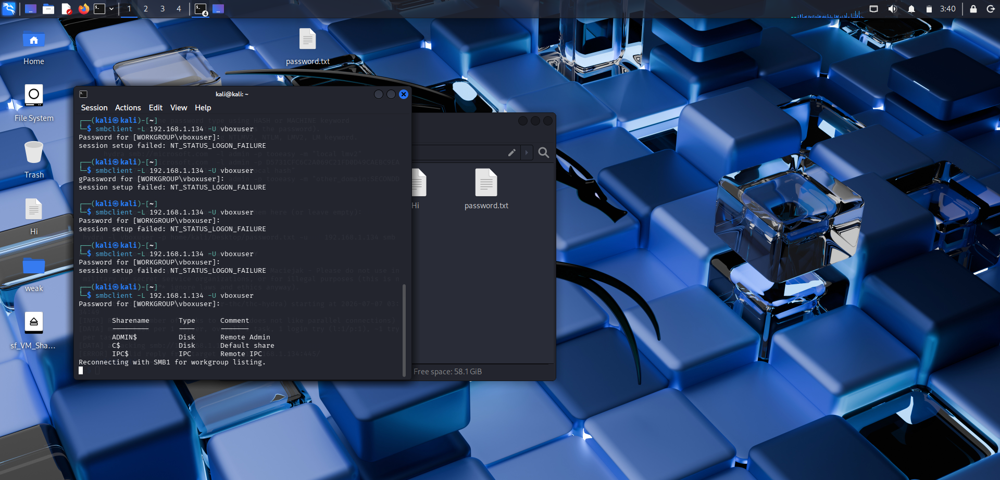
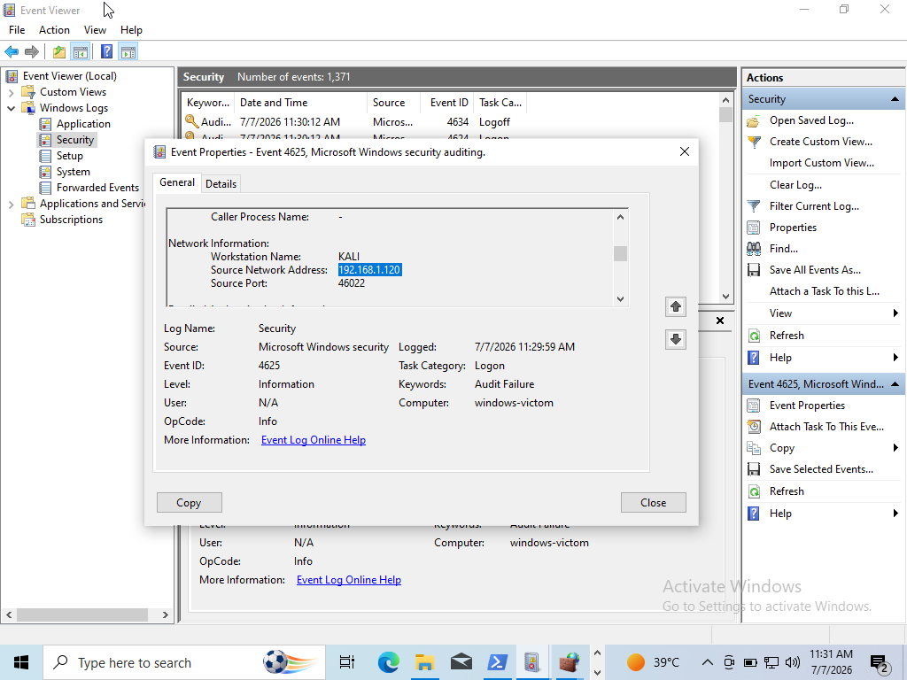
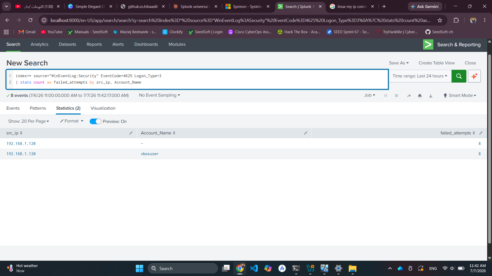

Manual attempts using `smbclient` (one password guess per invocation):
```bash
smbclient -L 192.168.1.134 -U vboxuser
```
Each run prompts for a password interactively — a wrong guess returns `NT_STATUS_LOGON_FAILURE` (and generates a 4625 event on the victim), a correct guess lists the available shares.



## Detection

### Expected Windows Security Log Event (Event ID 4625)

Key fields:
- `Account Name`: attempted username
- `Source Network Address`: attacker IP
- `Logon Type`: **3** (Network — the SMB equivalent of RDP's Logon Type 10)



### Forwarding to Splunk

`inputs.conf`:
```ini
[WinEventLog://Security]
disabled = 0
sourcetype = WinEventLog:Security
```

### Splunk Detection Query

```spl
index=* sourcetype="WinEventLog:Security" EventCode=4625 Logon_Type=3
| stats count as failed_attempts by src_ip, Account_Name
| where failed_attempts > 3
```



## Tooling Friction Encountered (documented, not hidden)

This attack surfaced real-world troubleshooting that's worth keeping in the writeup rather than editing out:

1. **Port 445 initially filtered** — Windows Firewall blocks inbound SMB by default. Resolved by enabling the "File and Printer Sharing (SMB-In)" inbound rule for the active (Private) network profile.
2. **Hydra "invalid reply from target"** — Hydra's SMB module has known compatibility issues parsing responses from modern SMB2/3 (Windows disabled legacy SMB1 by default post-WannaCry). This is a module-level limitation, not a lab misconfiguration.
3. **Resolution:** switched from Hydra to manual `smbclient` attempts, testing one password per invocation. This sidesteps Hydra's SMB module bug entirely and still generates the same Event ID 4625 / Logon Type 3 signature on the victim for each failed guess.

## Analysis

**What worked (once reachable):** Windows Security log captures every authentication attempt with source IP, target account, and logon type — regardless of protocol (RDP vs SMB), Event ID 4625 + Logon Type is the reliable signal.

**Detection logic:** multiple 4625 events (Logon Type 3) from one source IP in a short window = brute-force signature. This mirrors real production correlation searches (e.g., Splunk's built-in "Windows Account Brute Force" style content).

**Real-world nuance:** actual brute-force campaigns are frequently distributed across many source IPs (botnets) rather than one, which would evade a single-IP threshold. A production detection would also need to catch low-and-slow, distributed patterns.

**Lesson:** offensive tooling doesn't always "just work" against modern Windows defaults — legacy protocol assumptions (SMB1, RDP host support) baked into older tools and tutorials frequently hit friction against current OS configurations. Falling back to a manual, tool-agnostic method (`smbclient`) when automation breaks is itself a realistic skill — real attackers and testers frequently have to work around broken or incompatible tooling mid-engagement.
password123
admin123
letmein123
qwerty123
<actual VM password>

Manual attempts using `smbclient` (one password guess per invocation):
```bash
smbclient -L 192.168.1.134 -U vboxuser
```
Each run prompts for a password interactively — a wrong guess returns `NT_STATUS_LOGON_FAILURE` (and generates a 4625 event on the victim), a correct guess lists the available shares.


## Detection

### Expected Windows Security Log Event (Event ID 4625)

Key fields:
- `Account Name`: attempted username
- `Source Network Address`: attacker IP
- `Logon Type`: **3** (Network — the SMB equivalent of RDP's Logon Type 10)


### Forwarding to Splunk

`inputs.conf`:
```ini
[WinEventLog://Security]
disabled = 0
sourcetype = WinEventLog:Security
```

### Splunk Detection Query

```spl
index=* sourcetype="WinEventLog:Security" EventCode=4625 Logon_Type=3
| stats count as failed_attempts by src_ip, Account_Name
| where failed_attempts > 3
```


## Tooling Friction Encountered (documented, not hidden)

This attack surfaced real-world troubleshooting that's worth keeping in the writeup rather than editing out:

1. **Port 445 initially filtered** — Windows Firewall blocks inbound SMB by default. Resolved by enabling the "File and Printer Sharing (SMB-In)" inbound rule for the active (Private) network profile.
2. **Hydra "invalid reply from target"** — Hydra's SMB module has known compatibility issues parsing responses from modern SMB2/3 (Windows disabled legacy SMB1 by default post-WannaCry). This is a module-level limitation, not a lab misconfiguration.
3. **Resolution:** switched from Hydra to manual `smbclient` attempts, testing one password per invocation. This sidesteps Hydra's SMB module bug entirely and still generates the same Event ID 4625 / Logon Type 3 signature on the victim for each failed guess.

## Analysis

**What worked (once reachable):** Windows Security log captures every authentication attempt with source IP, target account, and logon type — regardless of protocol (RDP vs SMB), Event ID 4625 + Logon Type is the reliable signal.

**Detection logic:** multiple 4625 events (Logon Type 3) from one source IP in a short window = brute-force signature. This mirrors real production correlation searches (e.g., Splunk's built-in "Windows Account Brute Force" style content).

**Real-world nuance:** actual brute-force campaigns are frequently distributed across many source IPs (botnets) rather than one, which would evade a single-IP threshold. A production detection would also need to catch low-and-slow, distributed patterns.

**Lesson:** offensive tooling doesn't always "just work" against modern Windows defaults — legacy protocol assumptions (SMB1, RDP host support) baked into older tools and tutorials frequently hit friction against current OS configurations. Falling back to a manual, tool-agnostic method (`smbclient`) when automation breaks is itself a realistic skill — real attackers and testers frequently have to work around broken or incompatible tooling mid-engagement.