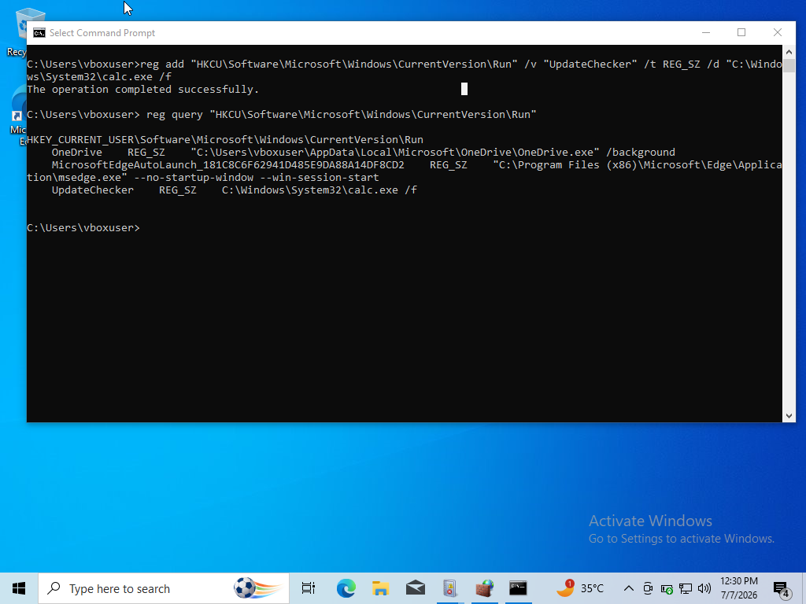
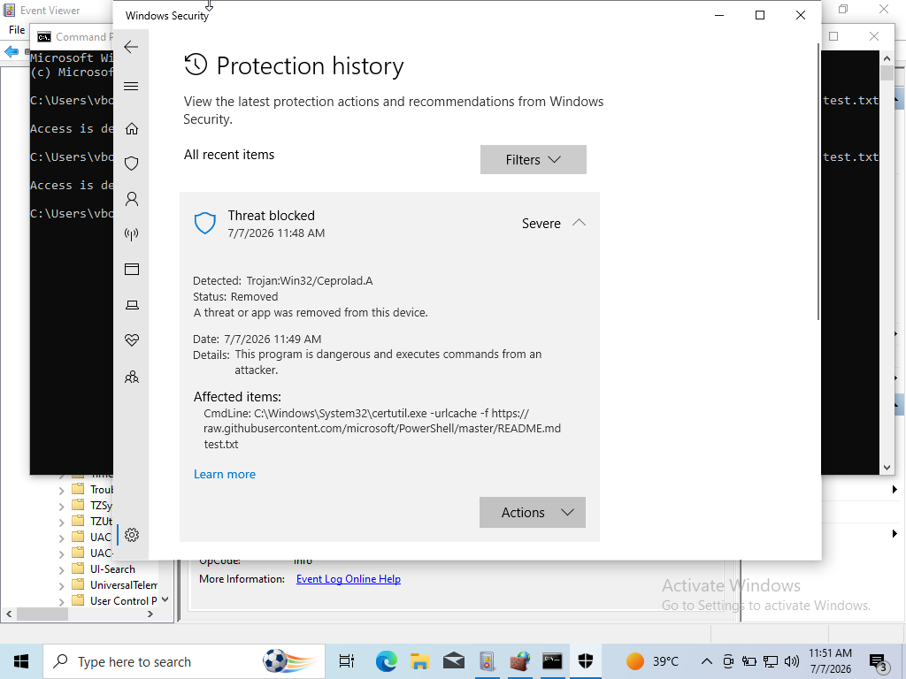
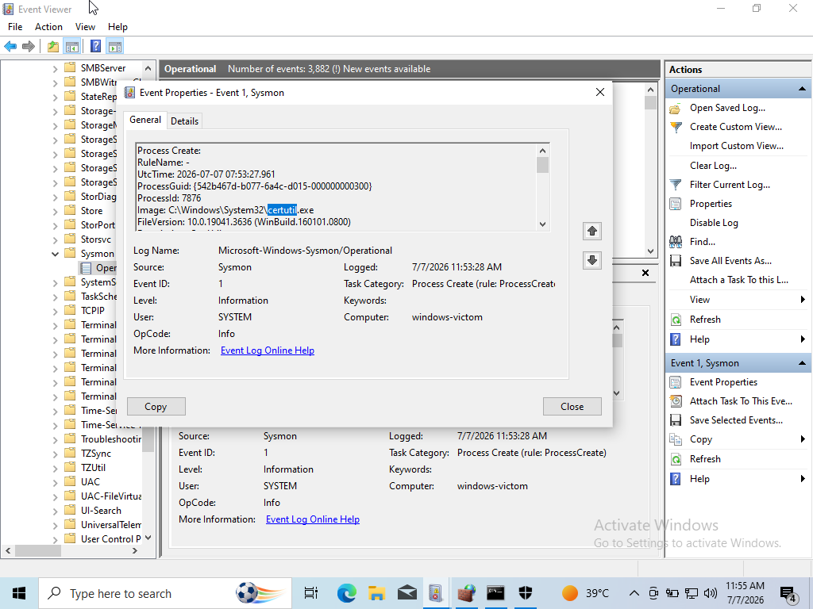
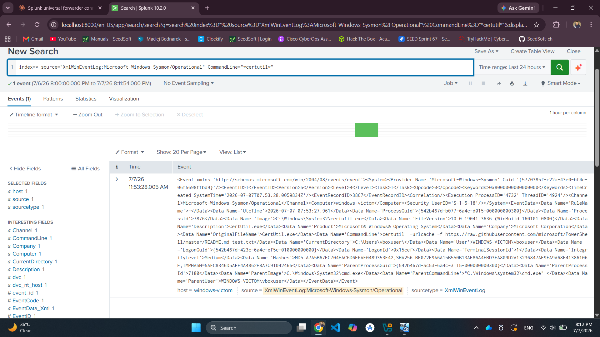

# Attack 4: LOLBin Abuse Attempt — certutil

**MITRE ATT&CK:** [T1105 — Ingress Tool Transfer](https://attack.mitre.org/techniques/T1105/) via [T1218 — System Binary Proxy Execution](https://attack.mitre.org/techniques/T1218/)

## Objective

Simulate an attacker abusing a legitimate, trusted Windows binary (`certutil.exe`) to download a file — a classic "living-off-the-land" (LOLBin) technique used to blend in with normal system activity and evade tools that only watch for obviously suspicious binaries.

## Environment

- **Executed on:** Windows victim VM
- **Detection source:** Sysmon (Event ID 1) → Splunk
- **Note:** this attack was run twice. The first run was blocked upstream by Windows Defender before Sysmon had anything to log. Real-time protection was then temporarily disabled (lab-only) to observe the full Sysmon → Splunk detection chain, and re-enabled immediately afterward.

## Attack Steps

```cmd
certutil -urlcache -split -f https://raw.githubusercontent.com/microsoft/PowerShell/master/README.md test.txt
```



## Run 1: Blocked by Windows Defender

With real-time protection active, Windows Defender's built-in signature/heuristic detection recognized the `certutil -urlcache` pattern as a known malicious technique and blocked it before the download completed.



**Outcome:**

| Layer | Result |
|---|---|
| Attack executed | ✅ Command run on victim |
| Windows Defender | ✅ Blocked — first line of defense |
| Sysmon | ❌ No event — process never fully executed |
| Splunk | ❌ No data — nothing for Sysmon to forward |

## Run 2: Real-Time Protection Disabled (Lab-Only)

Real-time protection was temporarily turned off (Windows Security > Virus & threat protection > Manage settings) to observe the full detection chain, then turned back on immediately after this test.

With protection disabled, the command executed successfully and Sysmon captured it.

### Raw Sysmon Event (Event ID 1 — Process Create)

Key fields:
- `Image`: `C:\Windows\System32\certutil.exe`
- `CommandLine`: contains `-urlcache -split -f` and the target URL
- `ParentImage`: parent shell process (cmd.exe)



### Splunk Detection Query

```spl
index=* sourcetype="XmlWinEventLog:Microsoft-Windows-Sysmon/Operational" EventCode=1 Image="*certutil.exe"
```



**Outcome:**

| Layer | Result |
|---|---|
| Attack executed | ✅ Command run on victim (Defender disabled) |
| Windows Defender | ⚪ Not active for this run |
| Sysmon | ✅ Captured Event ID 1 with full command line |
| Splunk | ✅ Detection query returns the event |

## Analysis

**What happened:** this technique produced two different, equally valid outcomes depending on which defensive layer was active. With Windows Defender enabled, the attack was stopped before Sysmon ever saw it — a genuine illustration of defense-in-depth, where not every detection needs to happen in the SIEM. With Defender disabled, the same command flowed cleanly through Sysmon into Splunk, completing the intended detection chain.

**Why running it twice matters:** it demonstrates a real gap that exists in production environments — Sysmon+Splunk pipelines only see what actually executes. If an AV/EDR product silently blocks something upstream, an analyst relying solely on Sysmon/Splunk logs has zero visibility into that attempt; it has to be pulled from Defender's own logs (or a centralized EDR console) instead. In a mature environment, Defender/EDR logs should also be forwarded to the SIEM to close this exact visibility gap.

**Detection logic (Run 2):** searching for `certutil.exe` combined with `-urlcache` in the command line is a well-known, high-fidelity detection pattern — legitimate use of `certutil` for its intended certificate-management purpose almost never includes this flag combination, making it a low-noise, high-value detection rule.

**Safety note:** disabling real-time protection is only appropriate in an isolated, non-production lab environment, and only temporarily. Protection was re-enabled immediately after this test.