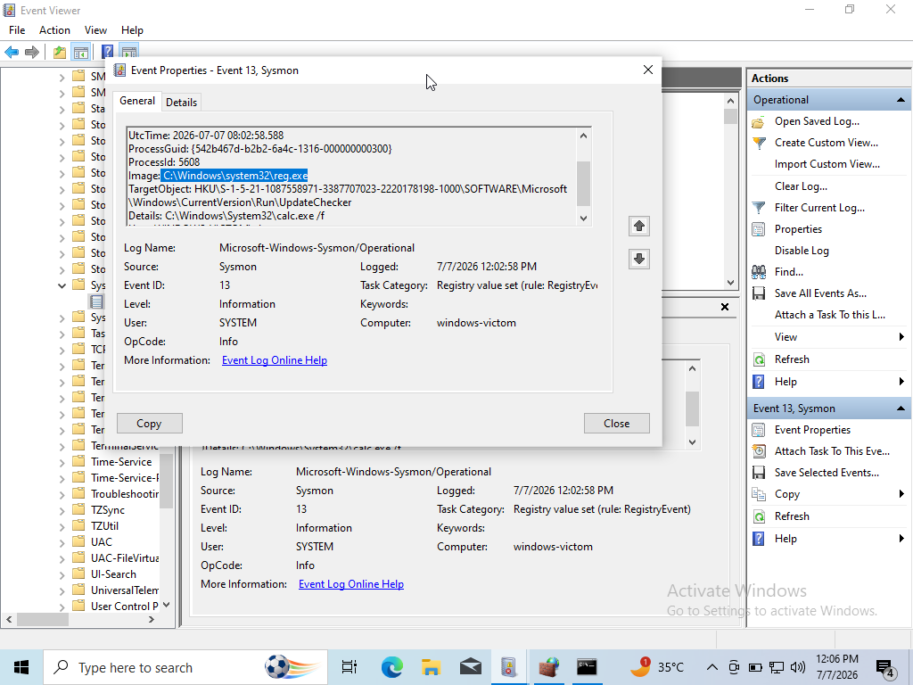
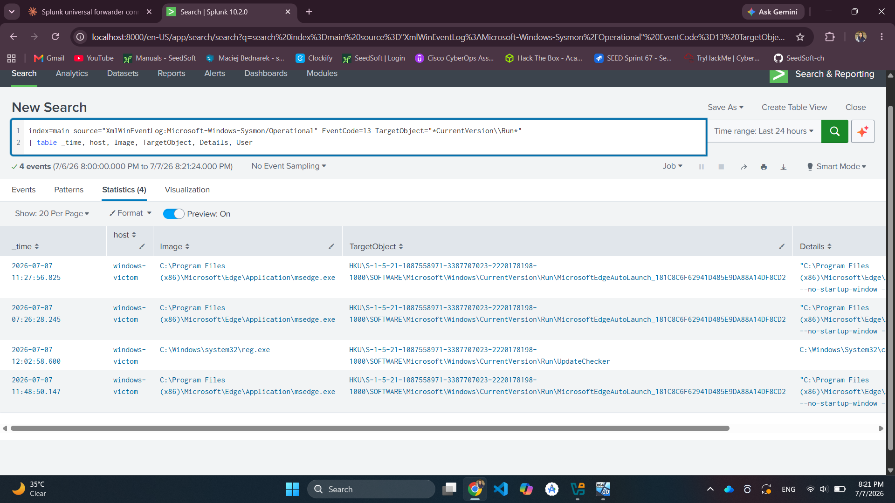
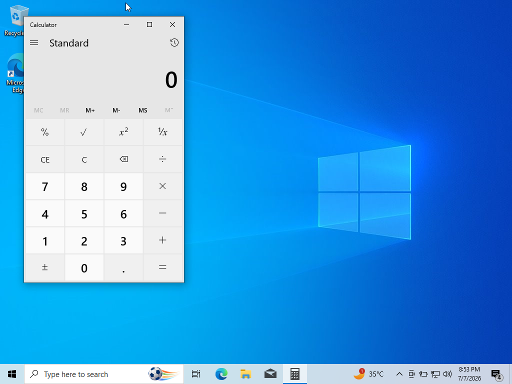

# Attack 5: Registry Run Key Persistence

**MITRE ATT&CK:** [T1547.001 — Boot or Logon Autostart Execution: Registry Run Keys / Startup Folder](https://attack.mitre.org/techniques/T1547/001/)

## Objective

Simulate an attacker establishing persistence by adding an entry to a Registry Run key, so a program automatically launches at every login — one of the most common techniques used by real malware to survive reboots.

## Environment

- **Executed on:** Windows victim VM
- **Detection source:** Sysmon (Event ID 13 — Registry Value Set) → Splunk

## Attack Steps

```cmd
reg add "HKCU\Software\Microsoft\Windows\CurrentVersion\Run" /v "UpdateChecker" /t REG_SZ /d "C:\Windows\System32\calc.exe" /f
```

`calc.exe` was used as a harmless stand-in payload — the technique is identical to what real malware uses with an actual malicious executable.

Verify the key was set:
```cmd
reg query "HKCU\Software\Microsoft\Windows\CurrentVersion\Run"
```


## Detection

### Raw Sysmon Event (Event ID 13 — Registry Value Set)

Key fields:
- `TargetObject`: `HKU\...\Software\Microsoft\Windows\CurrentVersion\Run\UpdateChecker`
- `Details`: `C:\Windows\System32\calc.exe`
- `Image`: `reg.exe` (process that made the change)



### Splunk Detection Query

```spl
index=main sourcetype="XmlWinEventLog:Microsoft-Windows-Sysmon/Operational" EventCode=13 TargetObject="*CurrentVersion\\Run*"
| table _time, host, Image, TargetObject, Details, User
```



### Proof of Persistence

After logging off and back on, Calculator launched automatically — confirming the persistence mechanism was live.



## Cleanup

```cmd
reg delete "HKCU\Software\Microsoft\Windows\CurrentVersion\Run" /v "UpdateChecker" /f
```

## Analysis

**What worked:** Sysmon Event ID 13 captured the exact registry key path, the value written, and the responsible process — everything needed to attribute and act on the change.

**Detection logic:** monitoring writes to Run/RunOnce keys is a high-value, low-noise detection, since legitimate day-to-day user activity rarely touches these keys directly (installers are typically the only routine writers).

**Real-world nuance:** attackers use far more convincing names and paths than "UpdateChecker" + calc.exe (e.g., mimicking legitimate service names, hiding in `AppData` paths). This means name-based detection alone is weak — the reliable signal is the *behavior* (an unexpected write to an autorun key), not the specific name or path used.

**Why this attack completes the lab well:** unlike Attack 4, this technique is a pure registry operation with no network callout or known-malicious binary signature, so it wasn't intercepted by Windows Defender — giving a clean, complete Sysmon → Splunk detection chain to close out the lab.
